

# InvestChest

## Overview

InvestChest was completed as part of the Winter 2020 assessment for the NYC Tech Talent Pipeline. The given instructions were to build a full-stack web-based stock portfolio application where users can purchase stock based on real-time values fetched from a third-party finance API.  The specifics regarding functionality (e.g. user registration, sign-in, purchase forms, portfolio and transaction page, etc.) were detailed ahead of time, as were wireframe styling guidelines.  Otherwise, I was free to utilize tools viewed best fit for the task.

Technologies used include <b>MERN (MongoDB, Express.js, React, Node.js) stack, Redux, Webpack, Sass, CSS3, HTML5, Recharts</b> and the third-party <b>IEX Cloud</b> finance API.  InvestChest is deployed within a <b>Docker Container</b> through <b>Amazon Web Services</b>.

### [This project is currently hosted at <b>investchest.derekwolpert.com</b> - CLICK HERE to visit the live version of this project](https://investchest.derekwolpert.com)

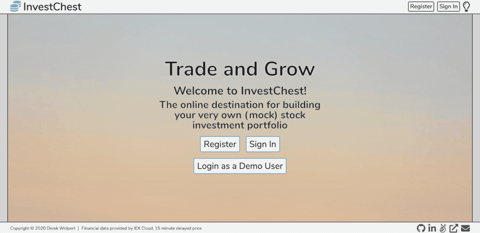

## Architecture & Technologies

- <b>React</b>, a JavaScript library used to assist with efficient management of rapidly changing data and maintaining a single-page web application structure.
- <b>Redux</b>, a JavaScript library used in coordination with React to create a centralized store for organizing and accessing data.
- <b>Node.js</b>, a runtime environment used to execute JavaScript for server-side scripting.
- <b>Express.js</b>, a web application framework, used with Node.js, to provide server-side structure for querying and retrieval of API data.
- <b>JavaScript</b>, the project's front and backend programing language.
- <b>MongoDB</b>, a document-oriented (NoSQL) database system used for storage and management of information.
- <b>Webpack</b>, a JavaScript bundler to assist with development and production builds.
- <b>Sass, CSS3 and HTML5</b>, used to manage the presentation and styling of the project.
- <b>Recharts</b>, a JavaScript library built upon D3.js to assist with data visualization management in a React based project. 
- <b>IEX Cloud</b>, a third-party finance API used to query and receive real-time stock prices.
- <b>Docker</b>, containerization platform that allows the creation of lightweight/portable environments to run the project.
- <b>Amazon Web Services</b>, an on-demand cloud computing platform utilized to assist with storage and deployment of the project (using ECR, ECS and EC2 along with appropriate network configuration).

NOTE: In order to avoid exceeding IEX's free-tier API call limit, Sandbox testing mode is utilized for the stock chart data - therefore the information used within the chart is purposely inaccurate. Other financial information (e.g. latest price, last updated, company name etc.) for stocks are unaffected, and should be accurate to within 15 minutes of current status.

You can read more about Sandbox testing mode in IEX's docs: https://iexcloud.io/docs/api/#testing-sandbox

## Functionality

- Comprehensive registration/authentication behavior for management of user sessions, and keeping track of user information (e.g. available cash, trades association, etc.).
- Error handling for input fields to prevent invalid entries along with appropriate error messages (e.g. prevents users from signing in with incorrect credentials, stops a user from registering an account under a previously used email address, prevent purchase of a stocks that cost more than a user's available cash, etc.).
- Separate Portfolio and Transaction pages. Portfolio page displays an aggregated list of all stocks a user has purchased, and lists in alphabetical order based on stock ticker. If a stock was purchased in two separate transactions then the transactions are grouped together. Transaction page displays a list of each individual trade in reverse-chronological order.
- Color indicators for the pricing information on the Portfolio page to indicate if a stock's value has increased (green) or decreased (red) in price between the most recent opening and closing values. 
- An interactive stock chart, with hover effects, to allow users to review a selected stock's history before completing a purchase.
- Dynamic and auto-detecting light/dark mode in conjunction with a theme switch in the webpage's header.
- A polished, intuitive, responsive user interface/experience.

    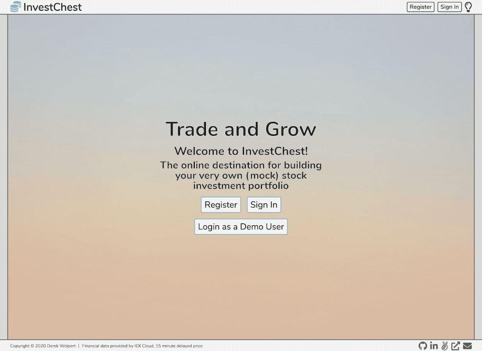
    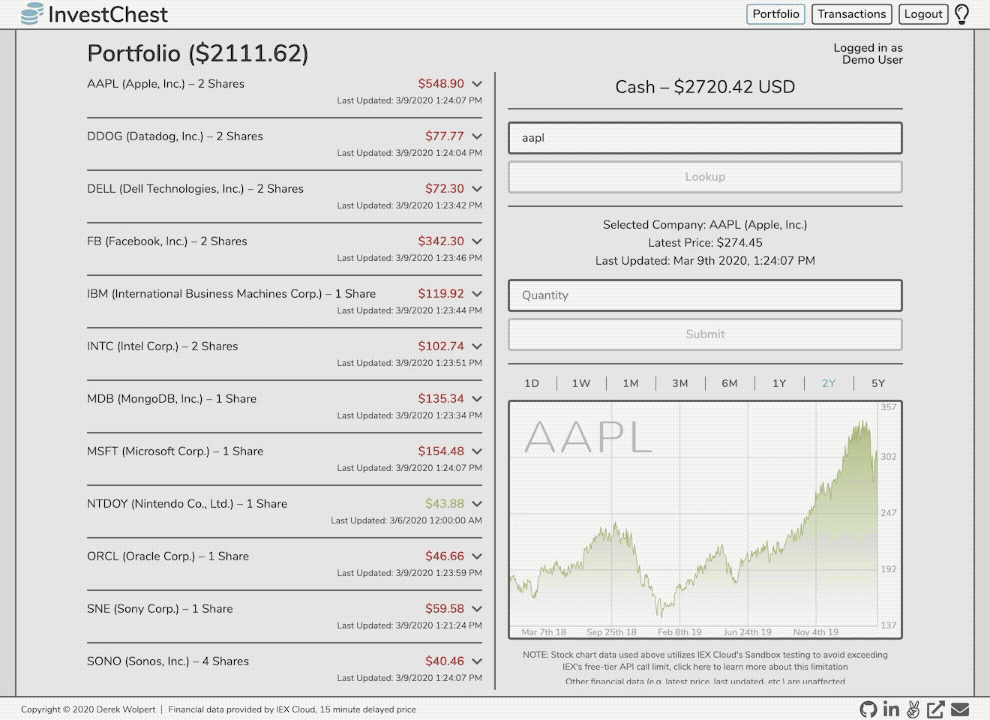

## Folder Structure

    # Backend Directory

    .
    ├── config          # includes access keys, and user auth config
    ├── frontend        # see the frontend directory below
    |   └── ...
    ├── models          # defines the structure of db schema
    ├── readme_images   # images used on this page
    ├── routes
    |   └── api         # set connection btw frontend, backend
    |                       # and db interactions
    └── validation      # checks an instances details before registering
                            # or modifying a db entry   

    # Frontend Directory

    frontend
    ├── dist                    # compiled js and css files
    ├── public                  # publicly accessible files
    |                               # including primary html   
    ├── src
    |   |── actions 
    |   |── components          # react components
    |   |   |── footer
    |   |   |── header
    |   |   |── modal
    |   |   |── portfolio
    |   |   |── purchase
    |   |   |── session
    |   |   |── splash
    |   |   |── stock_chart
    |   |   |── theme_switch
    |   |   └── transactions
    |   |── middleware          # includes a thunk middleware definition
    |   |── reducers            # organizes information for the
    |   |                           # global redux store
    |   |── store               # defines the redux store
    |   └── util                # sets api calls to access backend
    └── styles                  # design/styling files

## Wireframe vs. Final Design

    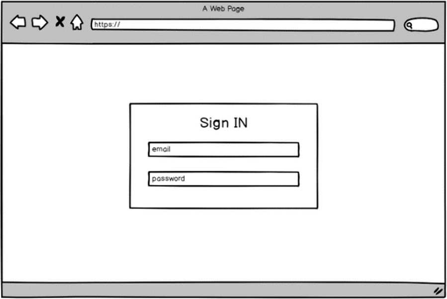
    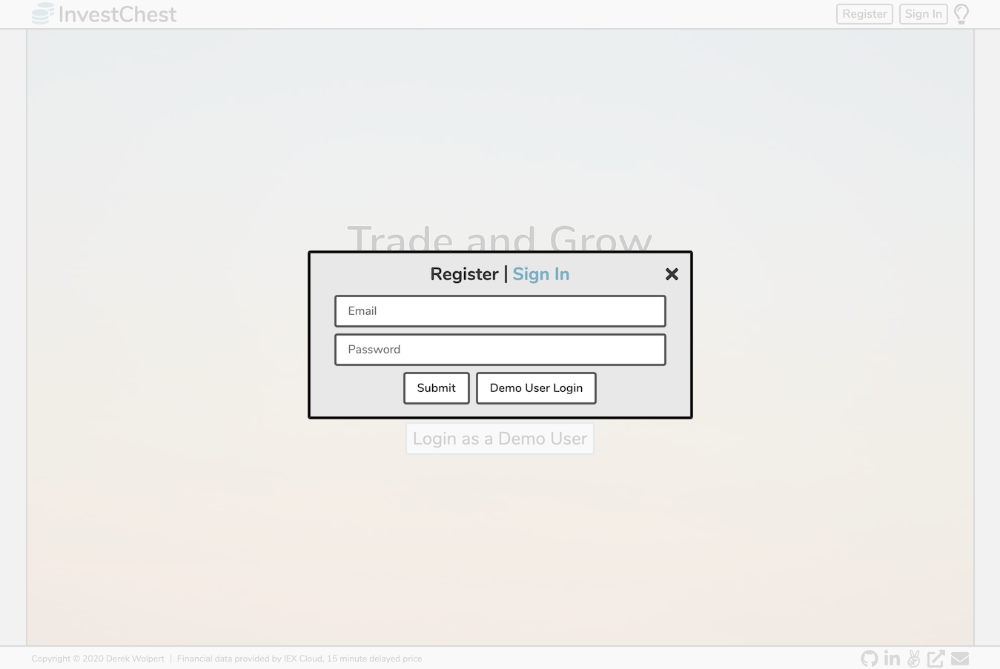

    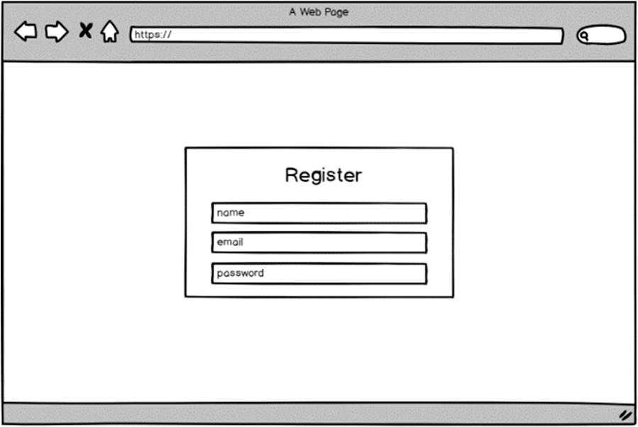
    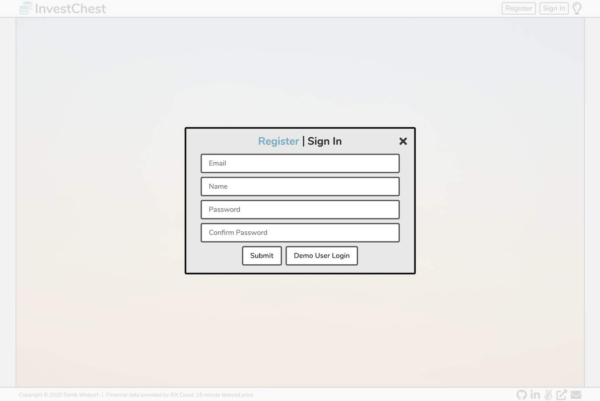

    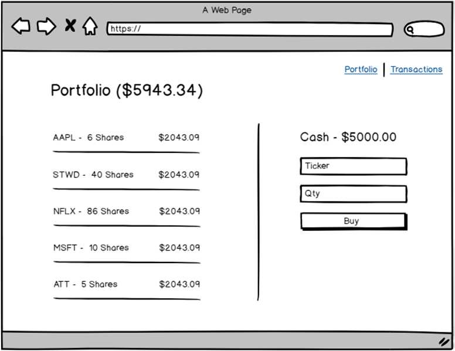
    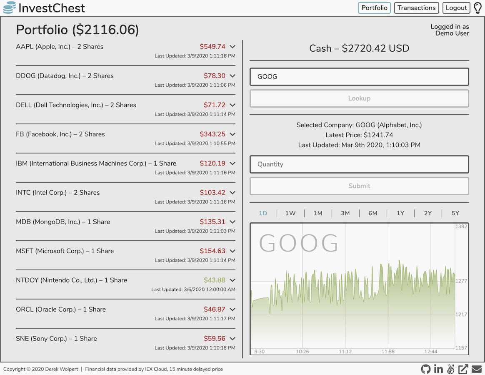

    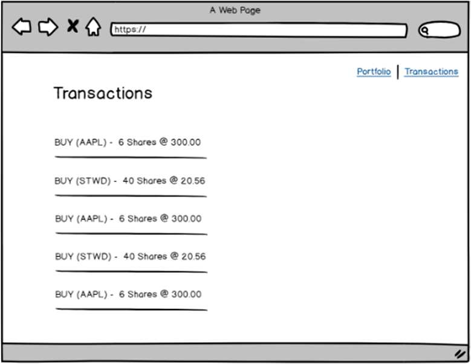
    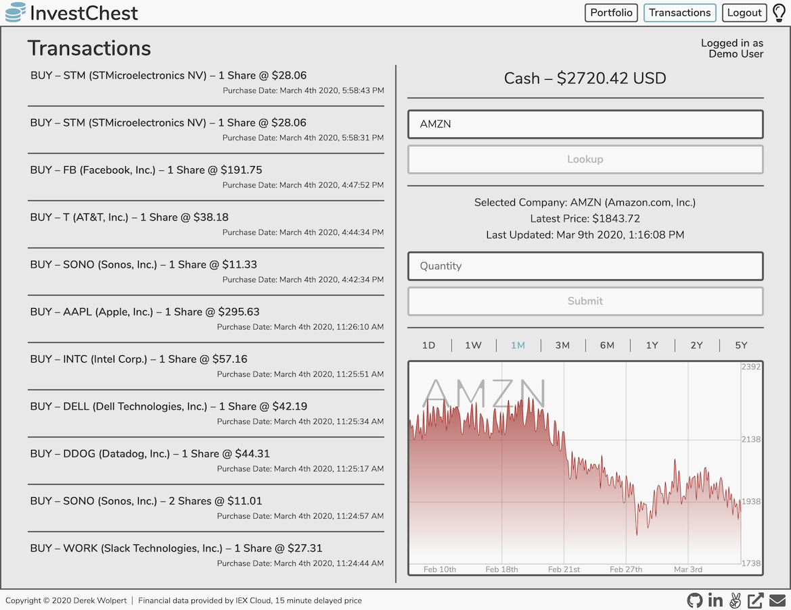

## Known Issues

- During after-market hours the IEX Cloud API can return inaccurate values for the latest price and previous closing price of a given stock ticker. Many aspects of this web-app rely on these values including the various green/red performance indicators and calculated profit values appearing throughout the site. This issue seems to be most prevalent after the transition into a new day, so it is likely caused by a datetime inconsistency between IEX and the source they use to access their financial data.

## Potential Future Features

- Implement selling of stocks, which would be included as their own separate entries on the Transaction page
- Enhanced responsiveness for various screen sizes, and mobile presentation optimization
- Enhanced ticker symbol field in the purchase form with predictive values based on valid inputs, allow querying based on company name

## Resources

- The background image for the splash page was taken by César Couto, and was feature on Unsplash: https://unsplash.com/photos/TIvFLeqZ4ec
- The basis for the styling of the loading spinner adapted from Loading.io: https://loading.io/css
- The CSS reset used in this project: https://meyerweb.com/eric/tools/css/reset
- Color selection variables inspired by Base16 default colors: http://chriskempson.com/projects/base16/
